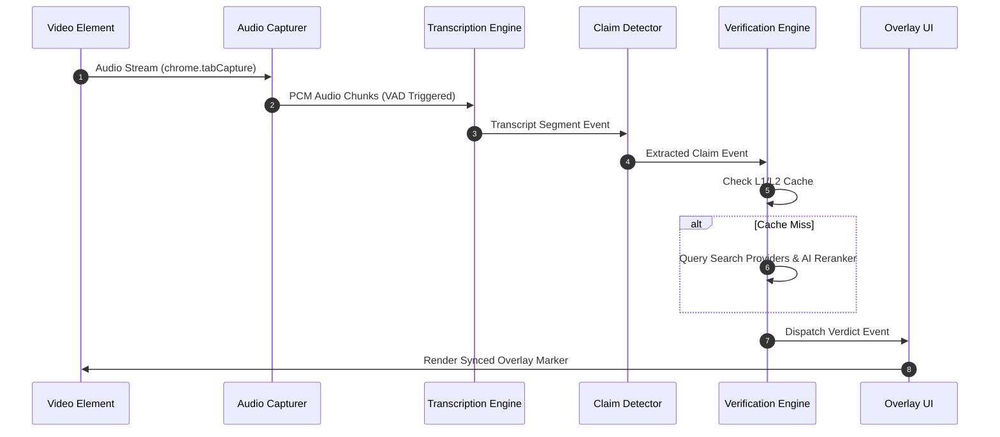

# Data Flow Architecture

The data pipeline operates as a pipeline of continuous events:

```mermaid
sequenceDiagram
    autonumber
    participant V as Video Element
    participant AC as Audio Capturer
    participant STT as Transcription Engine
    participant CD as Claim Detector
    participant VE as Verification Engine
    participant UI as Overlay UI

    V->>AC: Audio Stream (chrome.tabCapture)
    AC->>STT: PCM Audio Chunks (VAD Triggered)
    STT->>CD: Transcript Segment Event
    CD->>VE: Extracted Claim Event
    VE->>VE: Check L1/L2 Cache
    alt Cache Miss
        VE->>VE: Query Search Providers & AI Reranker
    end
    VE->>UI: Dispatch Verdict Event
    UI->>V: Render Synced Overlay Marker
```
