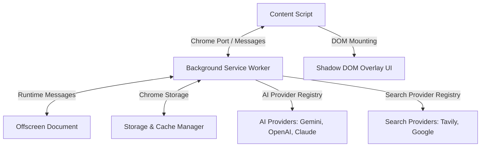

# High-Level System Architecture

## Architecture Overview
The system follows Clean Architecture principles divided into four Chrome Extension Manifest V3 execution boundaries:

1. **Content Script Layer**: DOM video element detection, video timestamp tracking, Shadow DOM overlay rendering, user interaction handling.
2. **Background Service Worker Layer**: Central Event Bus, State Machine Orchestrator, DI Container, Provider Registries, Queue Managers, Storage/Cache Manager.
3. **Offscreen Document Layer**: Audio capture (`chrome.tabCapture`), Voice Activity Detection (VAD), Web Speech / Whisper WebAssembly streaming transcription, Video OCR frame parsing.
4. **Popup & Options Layer**: Extension settings, API key management, model thresholds, developer debug console.

