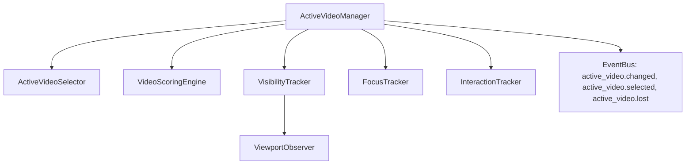

# Active Video Selection Engine - Architecture Blueprint

```mermaid
graph TD
  AVM[ActiveVideoManager] --> Selector[ActiveVideoSelector]
  AVM --> ScoringEngine[VideoScoringEngine]
  AVM --> VisibilityTracker[VisibilityTracker]
  AVM --> FocusTracker[FocusTracker]
  AVM --> InteractionTracker[InteractionTracker]
  VisibilityTracker --> ViewportObserver[ViewportObserver]
  AVM --> EB[EventBus: active_video.changed, active_video.selected, active_video.lost]
```
