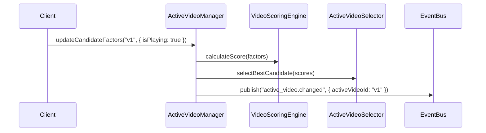

# Active Video Selection Engine - Sequence Diagram

```mermaid
sequenceDiagram
  Client->>ActiveVideoManager: updateCandidateFactors("v1", { isPlaying: true })
  ActiveVideoManager->>VideoScoringEngine: calculateScore(factors)
  ActiveVideoManager->>ActiveVideoSelector: selectBestCandidate(scores)
  ActiveVideoManager->>EventBus: publish("active_video.changed", { activeVideoId: "v1" })
```
