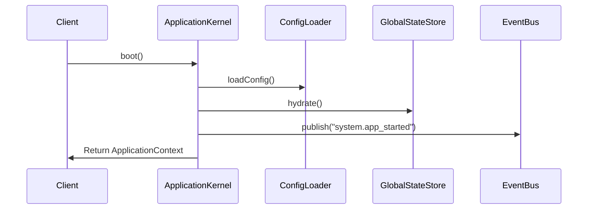

# Application Kernel - Sequence Diagram

```mermaid
sequenceDiagram
  Client->>ApplicationKernel: boot()
  ApplicationKernel->>ConfigLoader: loadConfig()
  ApplicationKernel->>GlobalStateStore: hydrate()
  ApplicationKernel->>EventBus: publish("system.app_started")
  ApplicationKernel->>Client: Return ApplicationContext
```
