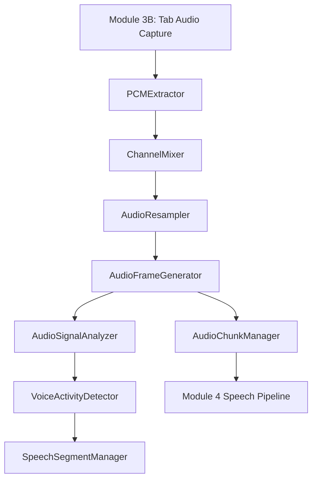

# Real-Time Audio Processing & Voice Activity Detection Engine - Architecture Blueprint

```mermaid
graph TD
  Capture[Module 3B: Tab Audio Capture] --> PCMExtractor[PCMExtractor]
  PCMExtractor --> ChannelMixer[ChannelMixer]
  ChannelMixer --> Resampler[AudioResampler]
  Resampler --> FrameGenerator[AudioFrameGenerator]
  FrameGenerator --> SignalAnalyzer[AudioSignalAnalyzer]
  SignalAnalyzer --> VAD[VoiceActivityDetector]
  VAD --> SegmentManager[SpeechSegmentManager]
  FrameGenerator --> ChunkManager[AudioChunkManager]
  ChunkManager --> Output[Module 4 Speech Pipeline]
```
