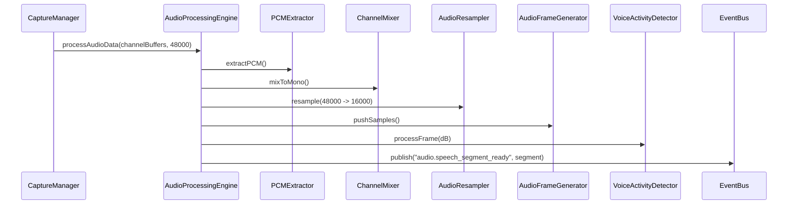

# Real-Time Audio Processing & Voice Activity Detection Engine - Sequence Diagram

```mermaid
sequenceDiagram
  CaptureManager->>AudioProcessingEngine: processAudioData(channelBuffers, 48000)
  AudioProcessingEngine->>PCMExtractor: extractPCM()
  AudioProcessingEngine->>ChannelMixer: mixToMono()
  AudioProcessingEngine->>AudioResampler: resample(48000 -> 16000)
  AudioProcessingEngine->>AudioFrameGenerator: pushSamples()
  AudioProcessingEngine->>VoiceActivityDetector: processFrame(dB)
  AudioProcessingEngine->>EventBus: publish("audio.speech_segment_ready", segment)
```
