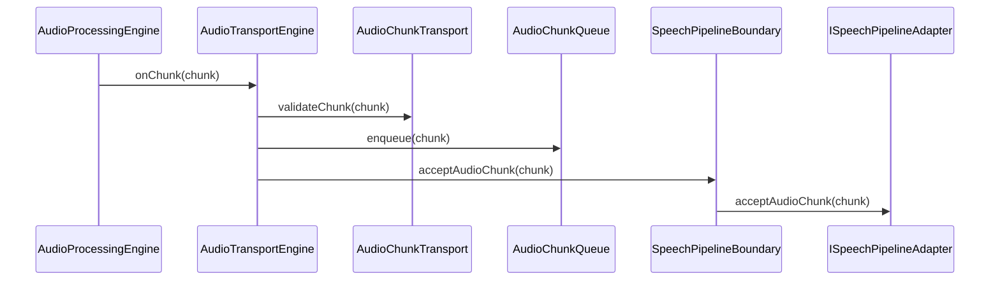

# Real-Time Audio Transport, Bounded Chunk Queue & Speech Pipeline Boundary - Sequence Diagram

```mermaid
sequenceDiagram
  AudioProcessingEngine->>AudioTransportEngine: onChunk(chunk)
  AudioTransportEngine->>AudioChunkTransport: validateChunk(chunk)
  AudioTransportEngine->>AudioChunkQueue: enqueue(chunk)
  AudioTransportEngine->>SpeechPipelineBoundary: acceptAudioChunk(chunk)
  SpeechPipelineBoundary->>ISpeechPipelineAdapter: acceptAudioChunk(chunk)
```
