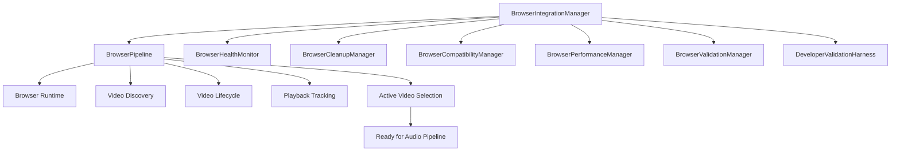

# Browser Integration & End-to-End Validation - Architecture Blueprint

```mermaid
graph TD
  BIM[BrowserIntegrationManager] --> Pipeline[BrowserPipeline]
  BIM --> HealthMonitor[BrowserHealthMonitor]
  BIM --> CleanupManager[BrowserCleanupManager]
  BIM --> CompatManager[BrowserCompatibilityManager]
  BIM --> PerfManager[BrowserPerformanceManager]
  BIM --> ValManager[BrowserValidationManager]
  BIM --> Harness[DeveloperValidationHarness]
  Pipeline --> Runtime[Browser Runtime]
  Pipeline --> Discovery[Video Discovery]
  Pipeline --> Lifecycle[Video Lifecycle]
  Pipeline --> Playback[Playback Tracking]
  Pipeline --> ActiveVideo[Active Video Selection]
  ActiveVideo --> Ready[Ready for Audio Pipeline]
```
