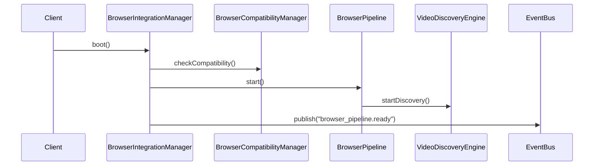

# Browser Integration & End-to-End Validation - Sequence Diagram

```mermaid
sequenceDiagram
  Client->>BrowserIntegrationManager: boot()
  BrowserIntegrationManager->>BrowserCompatibilityManager: checkCompatibility()
  BrowserIntegrationManager->>BrowserPipeline: start()
  BrowserPipeline->>VideoDiscoveryEngine: startDiscovery()
  BrowserIntegrationManager->>EventBus: publish("browser_pipeline.ready")
```
