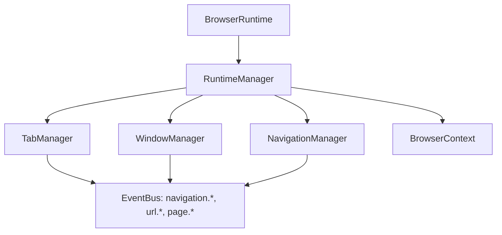

# Browser Runtime & Context Manager - Architecture Blueprint

```mermaid
graph TD
  BR[BrowserRuntime] --> RM[RuntimeManager]
  RM --> TM[TabManager]
  RM --> WM[WindowManager]
  RM --> NM[NavigationManager]
  RM --> BC[BrowserContext]
  TM --> EB[EventBus: tab.*]
  WM --> EB[EventBus: window.*]
  NM --> EB[EventBus: navigation.*, url.*, page.*]
```
