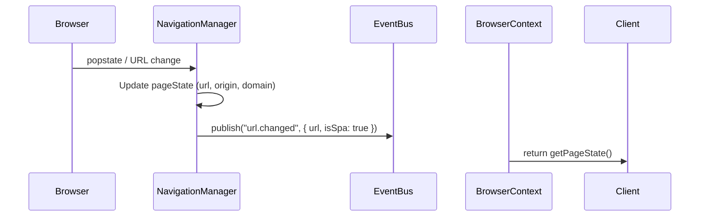

# Browser Runtime & Context Manager - Sequence Diagram

```mermaid
sequenceDiagram
  Browser->>NavigationManager: popstate / URL change
  NavigationManager->>NavigationManager: Update pageState (url, origin, domain)
  NavigationManager->>EventBus: publish("url.changed", { url, isSpa: true })
  BrowserContext->>Client: return getPageState()
```
