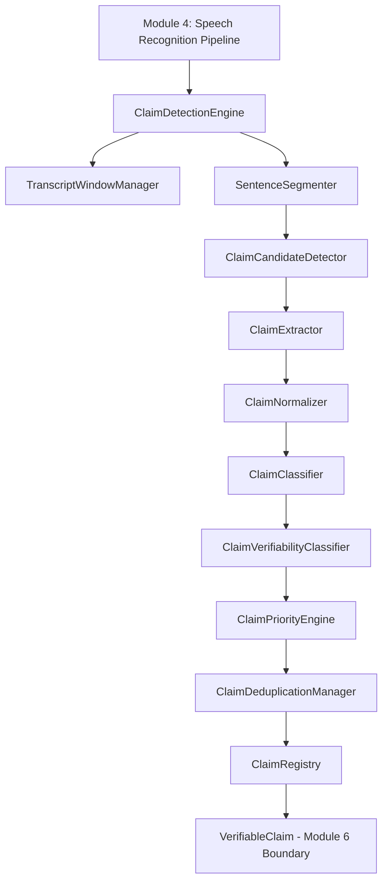

# Real-Time Claim Detection & Extraction Engine - Architecture Blueprint

```mermaid
graph TD
  Module4[Module 4: Speech Recognition Pipeline] --> Engine[ClaimDetectionEngine]
  Engine --> Window[TranscriptWindowManager]
  Engine --> Segmenter[SentenceSegmenter]
  Segmenter --> Detector[ClaimCandidateDetector]
  Detector --> Extractor[ClaimExtractor]
  Extractor --> Normalizer[ClaimNormalizer]
  Normalizer --> Classifier[ClaimClassifier]
  Classifier --> Verifiability[ClaimVerifiabilityClassifier]
  Verifiability --> Priority[ClaimPriorityEngine]
  Priority --> Deduplication[ClaimDeduplicationManager]
  Deduplication --> Registry[ClaimRegistry]
  Registry --> Output[VerifiableClaim - Module 6 Boundary]
```
