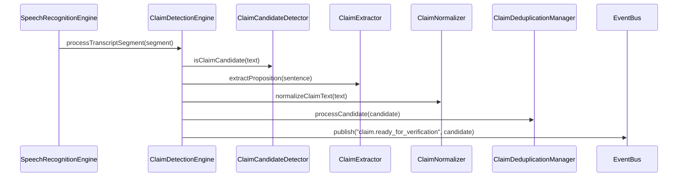

# Real-Time Claim Detection & Extraction Engine - Sequence Diagram

```mermaid
sequenceDiagram
  SpeechRecognitionEngine->>ClaimDetectionEngine: processTranscriptSegment(segment)
  ClaimDetectionEngine->>ClaimCandidateDetector: isClaimCandidate(text)
  ClaimDetectionEngine->>ClaimExtractor: extractProposition(sentence)
  ClaimDetectionEngine->>ClaimNormalizer: normalizeClaimText(text)
  ClaimDetectionEngine->>ClaimDeduplicationManager: processCandidate(candidate)
  ClaimDetectionEngine->>EventBus: publish("claim.ready_for_verification", candidate)
```
