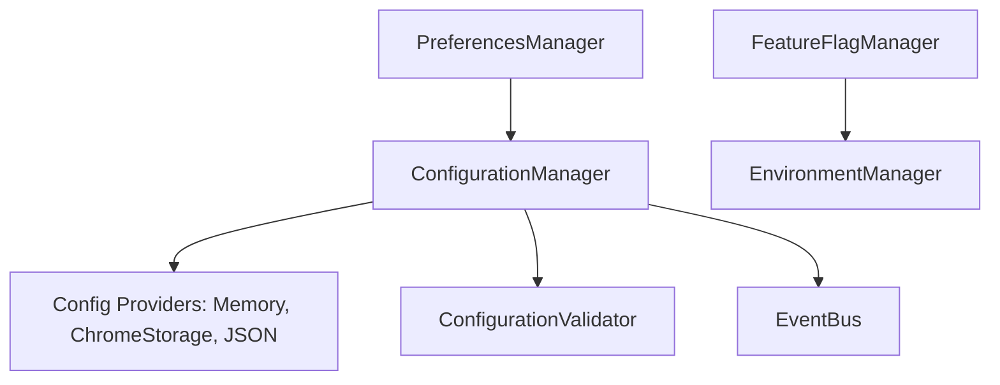

# Configuration & Feature Flags Platform - Architecture Blueprint

```mermaid
graph TD
  CM[ConfigurationManager] --> Providers[Config Providers: Memory, ChromeStorage, JSON]
  CM --> CV[ConfigurationValidator]
  CM --> EB[EventBus]
  FFM[FeatureFlagManager] --> EnvM[EnvironmentManager]
  PM[PreferencesManager] --> CM
```
