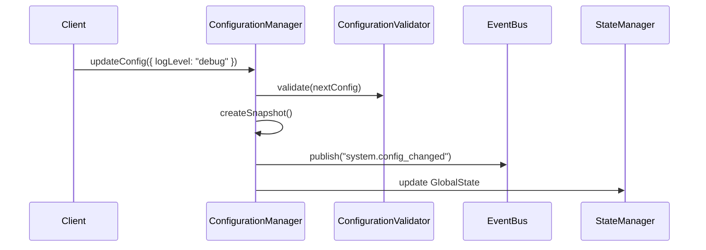

# Configuration & Feature Flags Platform - Sequence Diagram

```mermaid
sequenceDiagram
  Client->>ConfigurationManager: updateConfig({ logLevel: "debug" })
  ConfigurationManager->>ConfigurationValidator: validate(nextConfig)
  ConfigurationManager->>ConfigurationManager: createSnapshot()
  ConfigurationManager->>EventBus: publish("system.config_changed")
  ConfigurationManager->>StateManager: update GlobalState
```
