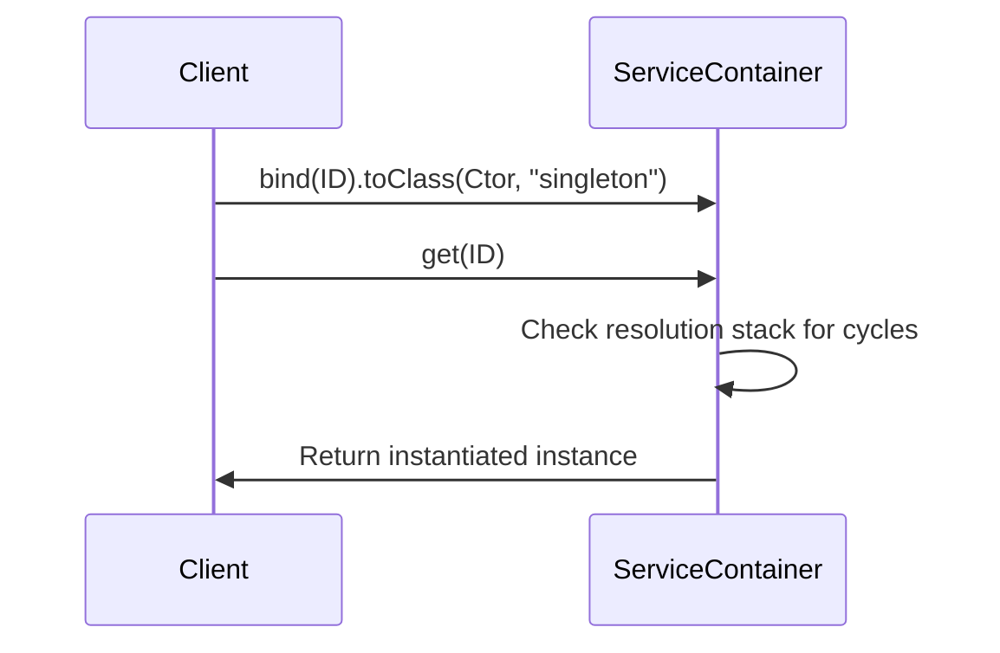

# Dependency Injection Container - Sequence Diagram

```mermaid
sequenceDiagram
  Client->>ServiceContainer: bind(ID).toClass(Ctor, "singleton")
  Client->>ServiceContainer: get(ID)
  ServiceContainer->>ServiceContainer: Check resolution stack for cycles
  ServiceContainer->>Client: Return instantiated instance
```
