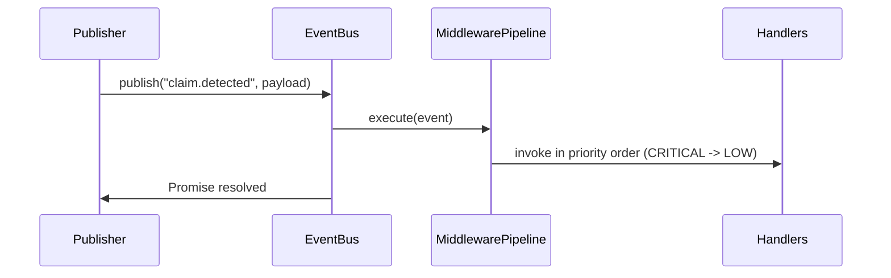

# Event Bus Infrastructure - Sequence Diagram

```mermaid
sequenceDiagram
  Publisher->>EventBus: publish("claim.detected", payload)
  EventBus->>MiddlewarePipeline: execute(event)
  MiddlewarePipeline->>Handlers: invoke in priority order (CRITICAL -> LOW)
  EventBus->>Publisher: Promise resolved
```
