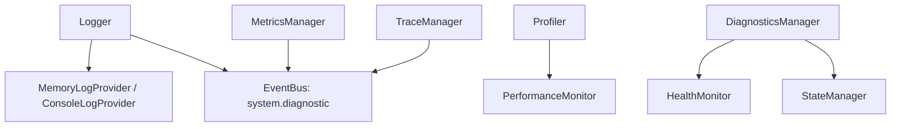

# Observability, Logging & Diagnostics Platform - Architecture Blueprint

```mermaid
graph TD
  Logger --> Providers[MemoryLogProvider / ConsoleLogProvider]
  Logger --> EventBus[EventBus: system.diagnostic]
  MetricsManager --> EventBus
  TraceManager --> EventBus
  Profiler --> PerformanceMonitor
  DiagnosticsManager --> HealthMonitor
  DiagnosticsManager --> StateManager
```
