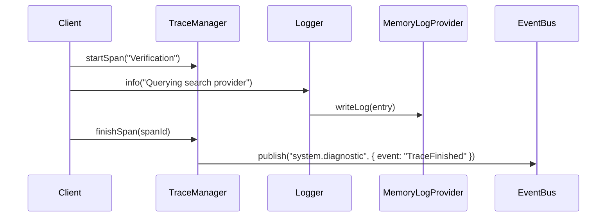

# Observability, Logging & Diagnostics Platform - Sequence Diagram

```mermaid
sequenceDiagram
  Client->>TraceManager: startSpan("Verification")
  Client->>Logger: info("Querying search provider")
  Logger->>MemoryLogProvider: writeLog(entry)
  Client->>TraceManager: finishSpan(spanId)
  TraceManager->>EventBus: publish("system.diagnostic", { event: "TraceFinished" })
```
