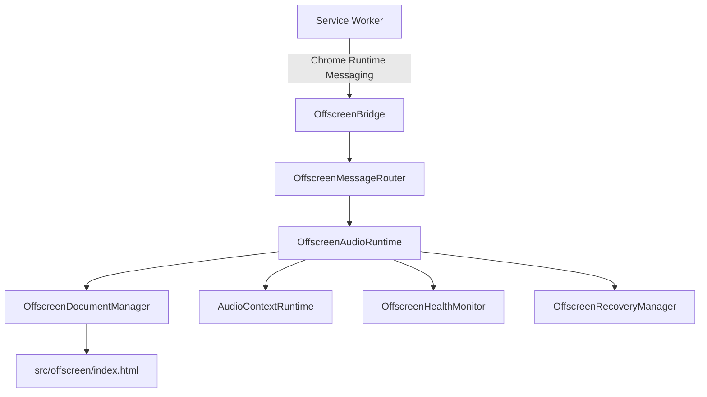

# Offscreen Audio Runtime - Architecture Blueprint

```mermaid
graph TD
  ServiceWorker[Service Worker] -->|Chrome Runtime Messaging| Bridge[OffscreenBridge]
  Bridge --> Router[OffscreenMessageRouter]
  Router --> Runtime[OffscreenAudioRuntime]
  Runtime --> DocManager[OffscreenDocumentManager]
  Runtime --> AudioRuntime[AudioContextRuntime]
  DocManager --> OffscreenDoc[src/offscreen/index.html]
  Runtime --> HealthMonitor[OffscreenHealthMonitor]
  Runtime --> RecoveryManager[OffscreenRecoveryManager]
```
