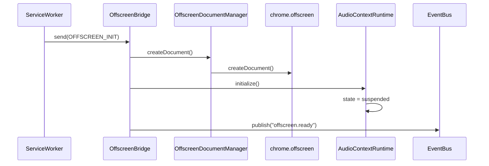

# Offscreen Audio Runtime - Sequence Diagram

```mermaid
sequenceDiagram
  ServiceWorker->>OffscreenBridge: send(OFFSCREEN_INIT)
  OffscreenBridge->>OffscreenDocumentManager: createDocument()
  OffscreenDocumentManager->>chrome.offscreen: createDocument()
  OffscreenBridge->>AudioContextRuntime: initialize()
  AudioContextRuntime->>AudioContextRuntime: state = suspended
  OffscreenBridge->>EventBus: publish("offscreen.ready")
```
