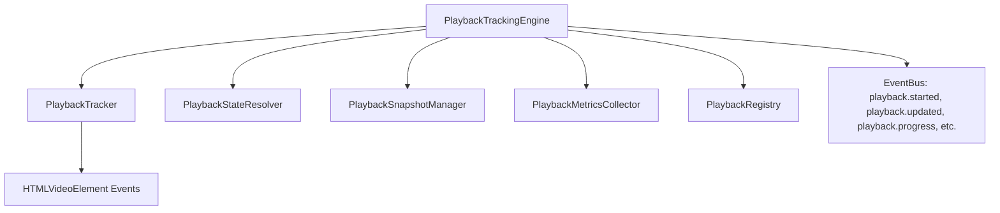

# Playback Tracking Engine - Architecture Blueprint

```mermaid
graph TD
  PTE[PlaybackTrackingEngine] --> Tracker[PlaybackTracker]
  PTE --> Resolver[PlaybackStateResolver]
  PTE --> SnapshotManager[PlaybackSnapshotManager]
  PTE --> MetricsCollector[PlaybackMetricsCollector]
  PTE --> Registry[PlaybackRegistry]
  Tracker --> DOM[HTMLVideoElement Events]
  PTE --> EB[EventBus: playback.started, playback.updated, playback.progress, etc.]
```
