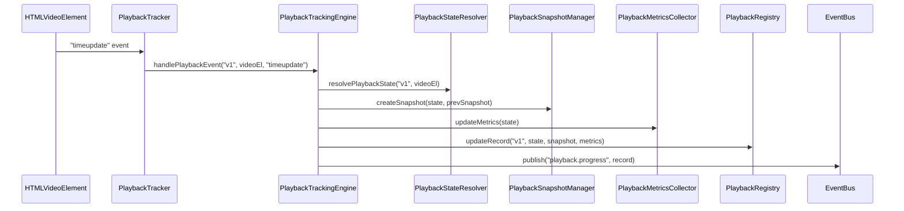

# Playback Tracking Engine - Sequence Diagram

```mermaid
sequenceDiagram
  HTMLVideoElement->>PlaybackTracker: "timeupdate" event
  PlaybackTracker->>PlaybackTrackingEngine: handlePlaybackEvent("v1", videoEl, "timeupdate")
  PlaybackTrackingEngine->>PlaybackStateResolver: resolvePlaybackState("v1", videoEl)
  PlaybackTrackingEngine->>PlaybackSnapshotManager: createSnapshot(state, prevSnapshot)
  PlaybackTrackingEngine->>PlaybackMetricsCollector: updateMetrics(state)
  PlaybackTrackingEngine->>PlaybackRegistry: updateRecord("v1", state, snapshot, metrics)
  PlaybackTrackingEngine->>EventBus: publish("playback.progress", record)
```
