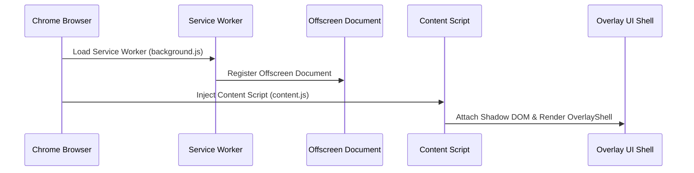

# Module 1A Initialization Data Flow

```mermaid
sequenceDiagram
    participant Chrome as Chrome Browser
    participant SW as Service Worker
    participant OD as Offscreen Document
    participant CS as Content Script
    participant UI as Overlay UI Shell

    Chrome->>SW: Load Service Worker (background.js)
    SW->>OD: Register Offscreen Document
    Chrome->>CS: Inject Content Script (content.js)
    CS->>UI: Attach Shadow DOM & Render OverlayShell
```
