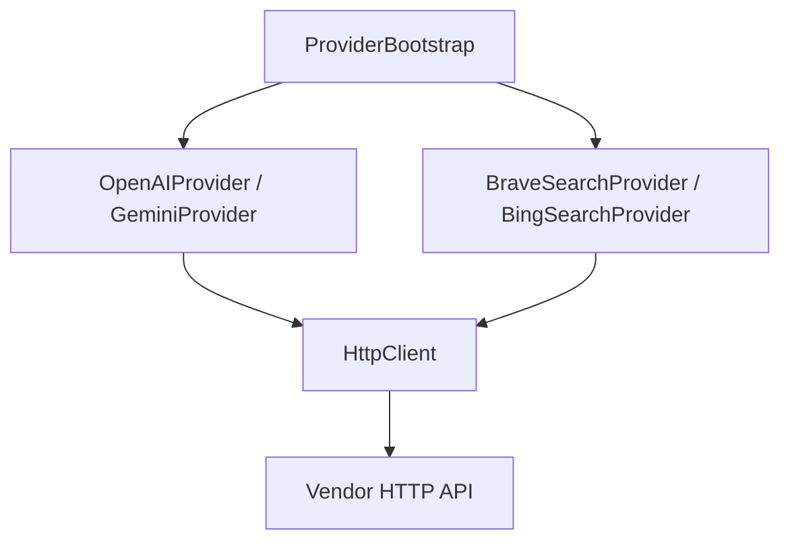

# Concrete Provider Adapter Layer - Architecture Blueprint

```mermaid
graph TD
  Bootstrap[ProviderBootstrap] --> AIAdapter[OpenAIProvider / GeminiProvider]
  Bootstrap --> SearchAdapter[BraveSearchProvider / BingSearchProvider]
  AIAdapter --> HttpClient[HttpClient]
  SearchAdapter --> HttpClient
  HttpClient --> ExternalAPI[Vendor HTTP API]
```
