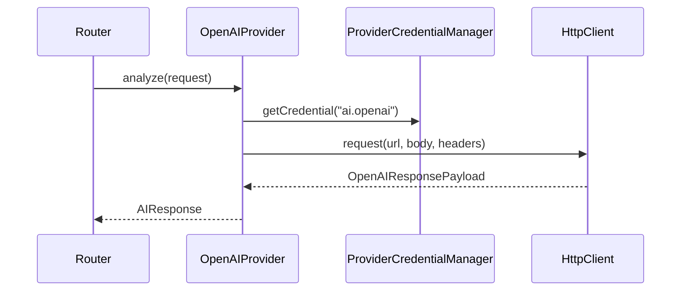

# Concrete Provider Adapter Layer - Sequence Diagram

```mermaid
sequenceDiagram
  Router->>OpenAIProvider: analyze(request)
  OpenAIProvider->>ProviderCredentialManager: getCredential("ai.openai")
  OpenAIProvider->>HttpClient: request(url, body, headers)
  HttpClient-->>OpenAIProvider: OpenAIResponsePayload
  OpenAIProvider-->>Router: AIResponse
```
