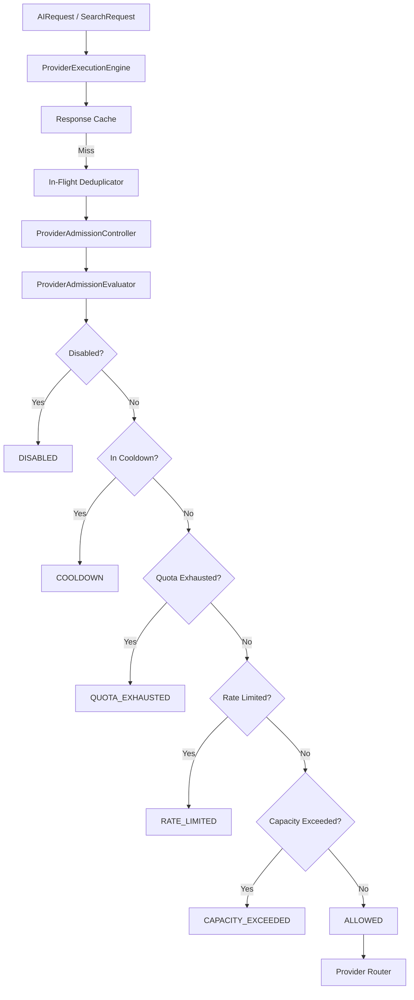

# Provider Admission Controller - Architecture Blueprint

```mermaid
graph TD
  Request[AIRequest / SearchRequest] --> Engine[ProviderExecutionEngine]
  Engine --> Cache[Response Cache]
  Cache -- Miss --> Deduplicator[In-Flight Deduplicator]
  Deduplicator --> Admission[ProviderAdmissionController]
  Admission --> Evaluator[ProviderAdmissionEvaluator]
  Evaluator --> CheckDisabled{Disabled?}
  CheckDisabled -- Yes --> DenyDisabled[DISABLED]
  CheckDisabled -- No --> CheckCooldown{In Cooldown?}
  CheckCooldown -- Yes --> DenyCooldown[COOLDOWN]
  CheckCooldown -- No --> CheckQuota{Quota Exhausted?}
  CheckQuota -- Yes --> DenyQuota[QUOTA_EXHAUSTED]
  CheckQuota -- No --> CheckRate{Rate Limited?}
  CheckRate -- Yes --> DenyRate[RATE_LIMITED]
  CheckRate -- No --> CheckCapacity{Capacity Exceeded?}
  CheckCapacity -- Yes --> DenyCapacity[CAPACITY_EXCEEDED]
  CheckCapacity -- No --> Allow[ALLOWED]
  Allow --> Router[Provider Router]
```
