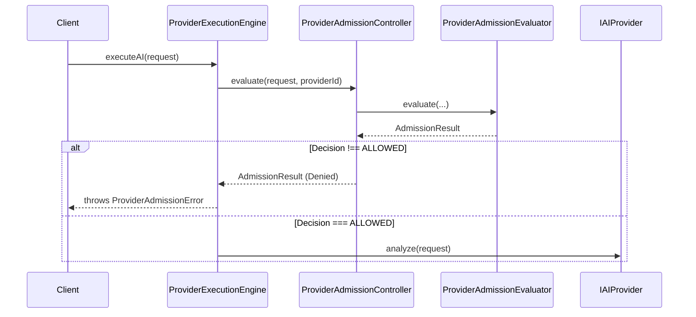

# Provider Admission Controller - Sequence Diagram

```mermaid
sequenceDiagram
  Client->>ProviderExecutionEngine: executeAI(request)
  ProviderExecutionEngine->>ProviderAdmissionController: evaluate(request, providerId)
  ProviderAdmissionController->>ProviderAdmissionEvaluator: evaluate(...)
  ProviderAdmissionEvaluator-->>ProviderAdmissionController: AdmissionResult
  alt Decision !== ALLOWED
    ProviderAdmissionController-->>ProviderExecutionEngine: AdmissionResult (Denied)
    ProviderExecutionEngine-->>Client: throws ProviderAdmissionError
  else Decision === ALLOWED
    ProviderExecutionEngine->>IAIProvider: analyze(request)
  end
```
