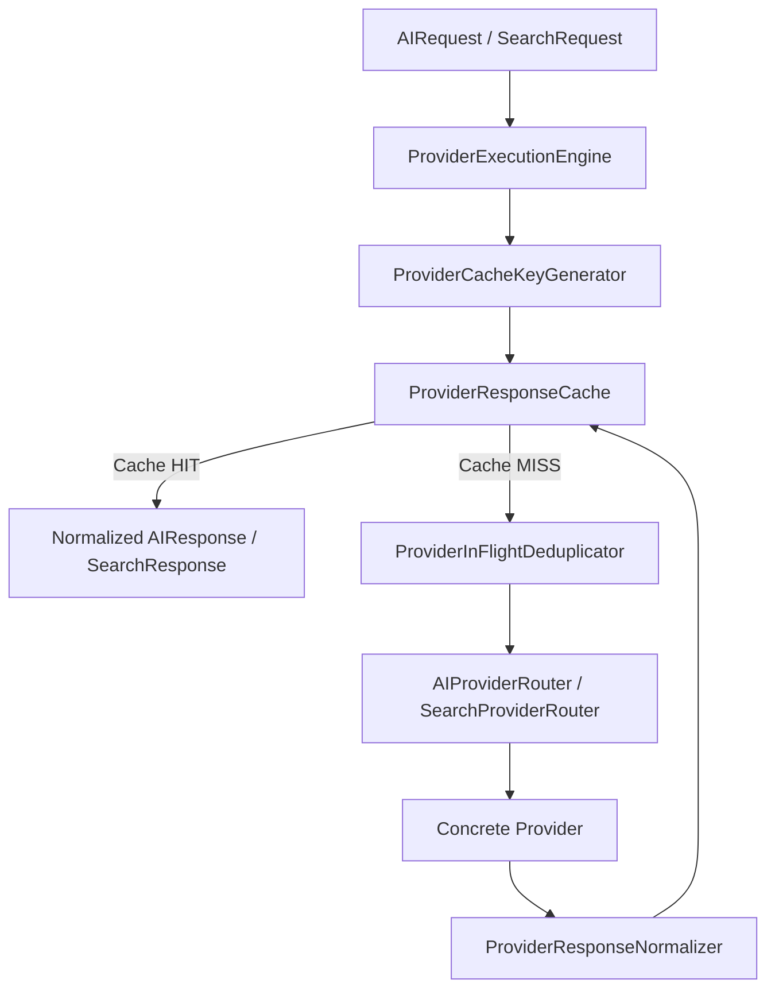

# Provider Response Caching & In-Flight Request Deduplication Layer - Architecture Blueprint

```mermaid
graph TD
  Request[AIRequest / SearchRequest] --> Engine[ProviderExecutionEngine]
  Engine --> KeyGen[ProviderCacheKeyGenerator]
  KeyGen --> Cache[ProviderResponseCache]
  Cache -- Cache HIT --> Response[Normalized AIResponse / SearchResponse]
  Cache -- Cache MISS --> Deduplicator[ProviderInFlightDeduplicator]
  Deduplicator --> Router[AIProviderRouter / SearchProviderRouter]
  Router --> Provider[Concrete Provider]
  Provider --> Normalizer[ProviderResponseNormalizer]
  Normalizer --> Cache
```
