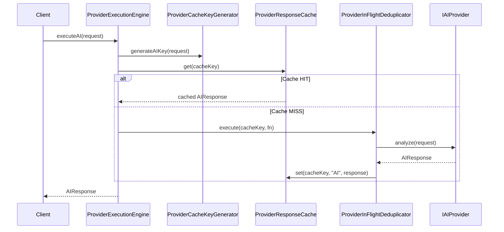

# Provider Response Caching & In-Flight Request Deduplication Layer - Sequence Diagram

```mermaid
sequenceDiagram
  Client->>ProviderExecutionEngine: executeAI(request)
  ProviderExecutionEngine->>ProviderCacheKeyGenerator: generateAIKey(request)
  ProviderExecutionEngine->>ProviderResponseCache: get(cacheKey)
  alt Cache HIT
    ProviderResponseCache-->>ProviderExecutionEngine: cached AIResponse
  else Cache MISS
    ProviderExecutionEngine->>ProviderInFlightDeduplicator: execute(cacheKey, fn)
    ProviderInFlightDeduplicator->>IAIProvider: analyze(request)
    IAIProvider-->>ProviderInFlightDeduplicator: AIResponse
    ProviderInFlightDeduplicator->>ProviderResponseCache: set(cacheKey, "AI", response)
  end
  ProviderExecutionEngine-->>Client: AIResponse
```
