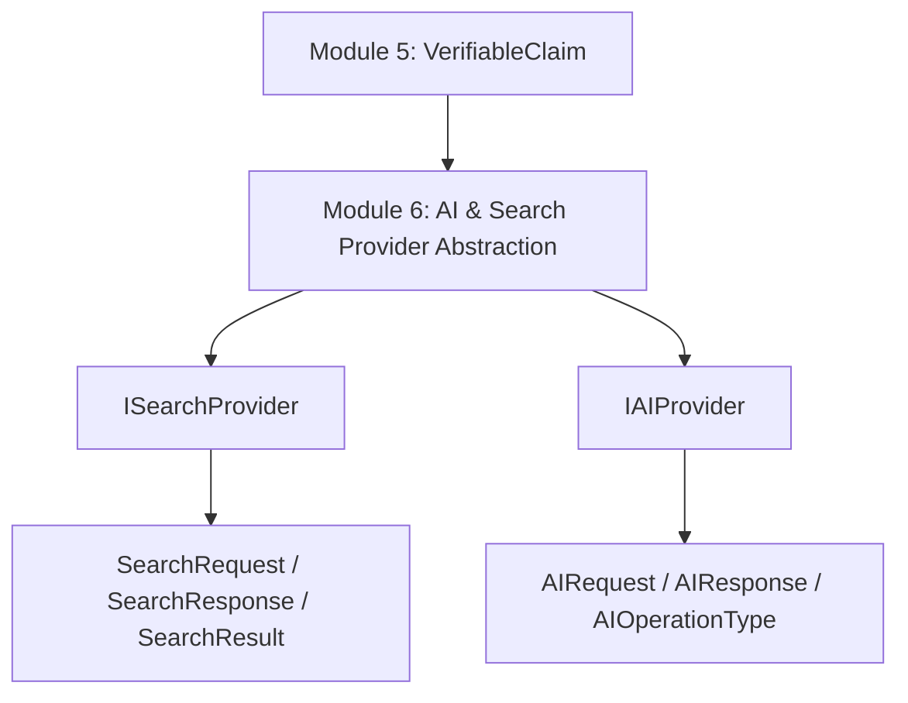

# AI & Search Provider Abstraction Layer — Provider Contracts - Architecture Blueprint

```mermaid
graph TD
  Module5[Module 5: VerifiableClaim] --> Module6Boundary[Module 6: AI & Search Provider Abstraction]
  Module6Boundary --> ISearchProvider[ISearchProvider]
  Module6Boundary --> IAIProvider[IAIProvider]
  ISearchProvider --> SearchTypes[SearchRequest / SearchResponse / SearchResult]
  IAIProvider --> AITypes[AIRequest / AIResponse / AIOperationType]
```
