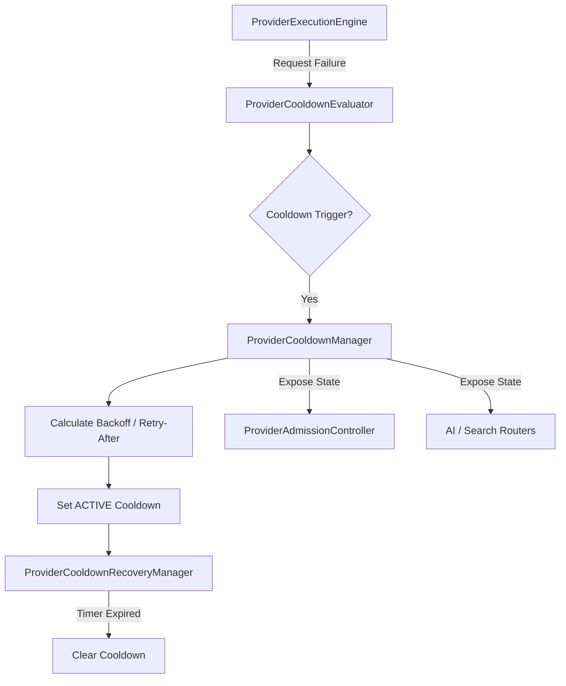

# Provider Cooldown & Recovery Manager - Architecture Blueprint

```mermaid
graph TD
  Engine[ProviderExecutionEngine] -- Request Failure --> Evaluator[ProviderCooldownEvaluator]
  Evaluator --> Classify{Cooldown Trigger?}
  Classify -- Yes --> Manager[ProviderCooldownManager]
  Manager --> CalcExpiration[Calculate Backoff / Retry-After]
  CalcExpiration --> SetState[Set ACTIVE Cooldown]
  SetState --> RecoveryMgr[ProviderCooldownRecoveryManager]
  RecoveryMgr -- Timer Expired --> Clear[Clear Cooldown]
  Manager -- Expose State --> Admission[ProviderAdmissionController]
  Manager -- Expose State --> Router[AI / Search Routers]
```
