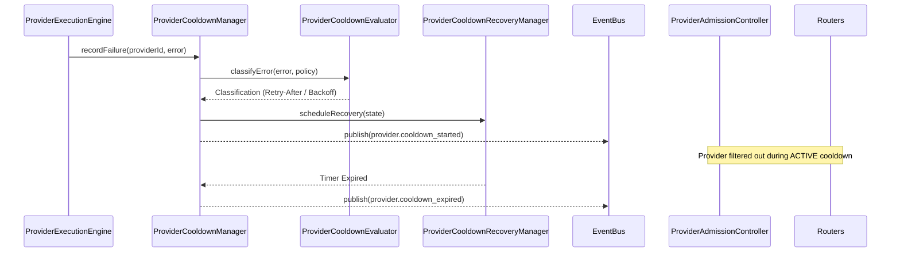

# Provider Cooldown & Recovery Manager - Sequence Diagram

```mermaid
sequenceDiagram
  ProviderExecutionEngine->>ProviderCooldownManager: recordFailure(providerId, error)
  ProviderCooldownManager->>ProviderCooldownEvaluator: classifyError(error, policy)
  ProviderCooldownEvaluator-->>ProviderCooldownManager: Classification (Retry-After / Backoff)
  ProviderCooldownManager->>ProviderCooldownRecoveryManager: scheduleRecovery(state)
  ProviderCooldownManager-->>EventBus: publish(provider.cooldown_started)
  Note over ProviderAdmissionController, Routers: Provider filtered out during ACTIVE cooldown
  ProviderCooldownRecoveryManager-->>ProviderCooldownManager: Timer Expired
  ProviderCooldownManager-->>EventBus: publish(provider.cooldown_expired)
```
