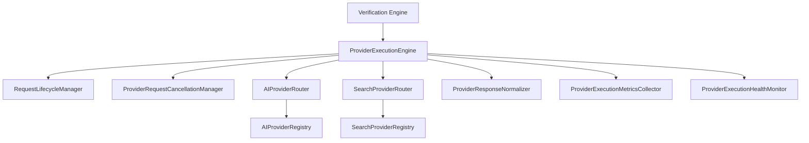

# Provider Execution & Request Orchestration Engine - Architecture Blueprint

```mermaid
graph TD
  Client[Verification Engine] --> Engine[ProviderExecutionEngine]
  Engine --> Lifecycle[RequestLifecycleManager]
  Engine --> Cancel[ProviderRequestCancellationManager]
  Engine --> AIRouter[AIProviderRouter]
  Engine --> SearchRouter[SearchProviderRouter]
  AIRouter --> AIRegistry[AIProviderRegistry]
  SearchRouter --> SearchRegistry[SearchProviderRegistry]
  Engine --> Normalizer[ProviderResponseNormalizer]
  Engine --> Metrics[ProviderExecutionMetricsCollector]
  Engine --> Health[ProviderExecutionHealthMonitor]
```
