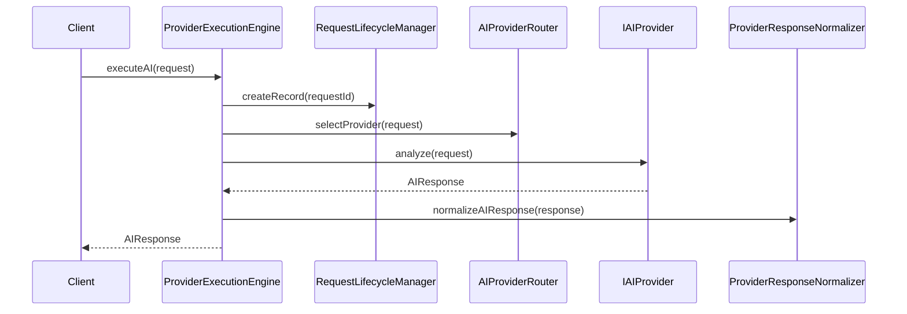

# Provider Execution & Request Orchestration Engine - Sequence Diagram

```mermaid
sequenceDiagram
  Client->>ProviderExecutionEngine: executeAI(request)
  ProviderExecutionEngine->>RequestLifecycleManager: createRecord(requestId)
  ProviderExecutionEngine->>AIProviderRouter: selectProvider(request)
  ProviderExecutionEngine->>IAIProvider: analyze(request)
  IAIProvider-->>ProviderExecutionEngine: AIResponse
  ProviderExecutionEngine->>ProviderResponseNormalizer: normalizeAIResponse(response)
  ProviderExecutionEngine-->>Client: AIResponse
```
