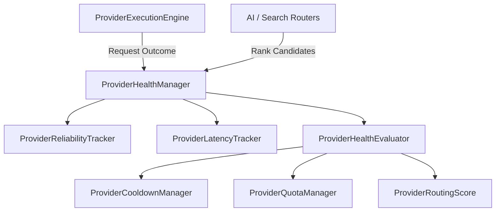

# Provider Health, Reliability & Quota-Aware Routing Scoring - Architecture Blueprint

```mermaid
graph TD
  Engine[ProviderExecutionEngine] -- Request Outcome --> HealthMgr[ProviderHealthManager]
  HealthMgr --> RelTracker[ProviderReliabilityTracker]
  HealthMgr --> LatTracker[ProviderLatencyTracker]
  Router[AI / Search Routers] -- Rank Candidates --> HealthMgr
  HealthMgr --> Evaluator[ProviderHealthEvaluator]
  Evaluator --> Cooldown[ProviderCooldownManager]
  Evaluator --> Quota[ProviderQuotaManager]
  Evaluator --> Score[ProviderRoutingScore]
```
