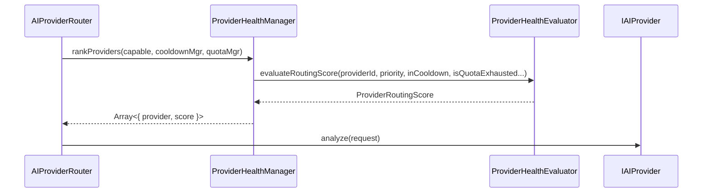

# Provider Health, Reliability & Quota-Aware Routing Scoring - Sequence Diagram

```mermaid
sequenceDiagram
  AIProviderRouter->>ProviderHealthManager: rankProviders(capable, cooldownMgr, quotaMgr)
  ProviderHealthManager->>ProviderHealthEvaluator: evaluateRoutingScore(providerId, priority, inCooldown, isQuotaExhausted...)
  ProviderHealthEvaluator-->>ProviderHealthManager: ProviderRoutingScore
  ProviderHealthManager-->>AIProviderRouter: Array<{ provider, score }>
  AIProviderRouter->>IAIProvider: analyze(request)
```
