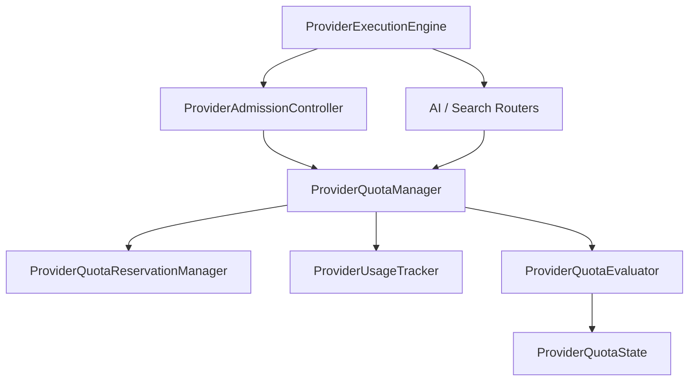

# Provider Quota Manager & Routing Integration - Architecture Blueprint

```mermaid
graph TD
  Engine[ProviderExecutionEngine] --> Admission[ProviderAdmissionController]
  Admission --> QuotaMgr[ProviderQuotaManager]
  Engine --> Router[AI / Search Routers]
  Router --> QuotaMgr
  QuotaMgr --> ResMgr[ProviderQuotaReservationManager]
  QuotaMgr --> UsageTracker[ProviderUsageTracker]
  QuotaMgr --> Evaluator[ProviderQuotaEvaluator]
  Evaluator --> Snapshot[ProviderQuotaState]
```
