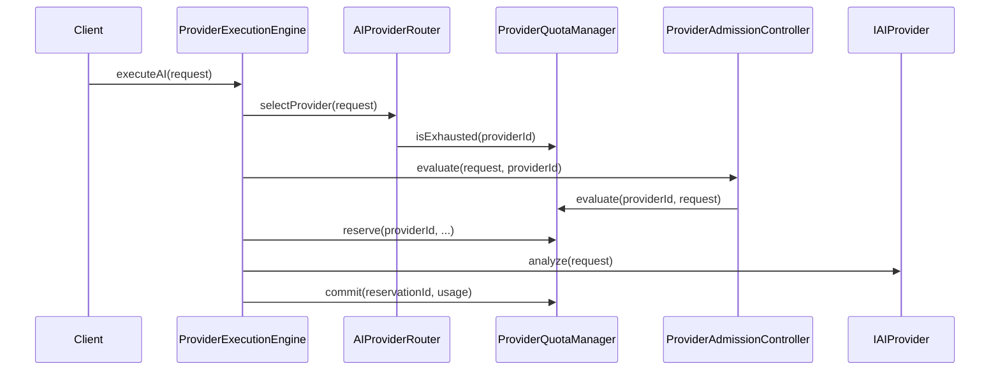

# Provider Quota Manager & Routing Integration - Sequence Diagram

```mermaid
sequenceDiagram
  Client->>ProviderExecutionEngine: executeAI(request)
  ProviderExecutionEngine->>AIProviderRouter: selectProvider(request)
  AIProviderRouter->>ProviderQuotaManager: isExhausted(providerId)
  ProviderExecutionEngine->>ProviderAdmissionController: evaluate(request, providerId)
  ProviderAdmissionController->>ProviderQuotaManager: evaluate(providerId, request)
  ProviderExecutionEngine->>ProviderQuotaManager: reserve(providerId, ...)
  ProviderExecutionEngine->>IAIProvider: analyze(request)
  ProviderExecutionEngine->>ProviderQuotaManager: commit(reservationId, usage)
```
