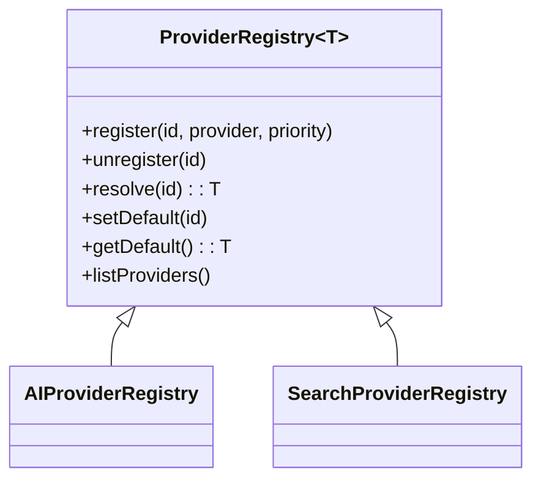

# Provider Registries Module - Architecture Blueprint

```mermaid
classDiagram
  class ProviderRegistry~T~ {
    +register(id, provider, priority)
    +unregister(id)
    +resolve(id): T
    +setDefault(id)
    +getDefault(): T
    +listProviders()
  }
  ProviderRegistry <|-- AIProviderRegistry
  ProviderRegistry <|-- SearchProviderRegistry
```
