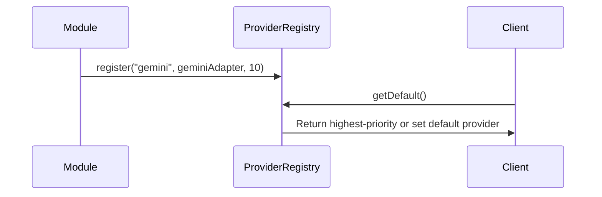

# Provider Registries Module - Sequence Diagram

```mermaid
sequenceDiagram
  Module->>ProviderRegistry: register("gemini", geminiAdapter, 10)
  Client->>ProviderRegistry: getDefault()
  ProviderRegistry->>Client: Return highest-priority or set default provider
```
