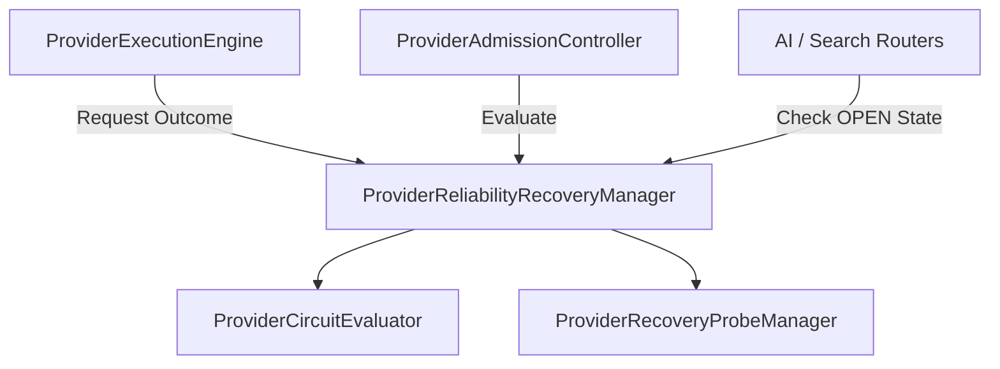

# Provider Reliability / Recovery & Circuit-Breaker Integration - Architecture Blueprint

```mermaid
graph TD
  Engine[ProviderExecutionEngine] -- Request Outcome --> RecoveryMgr[ProviderReliabilityRecoveryManager]
  RecoveryMgr --> Evaluator[ProviderCircuitEvaluator]
  RecoveryMgr --> ProbeMgr[ProviderRecoveryProbeManager]
  Admission[ProviderAdmissionController] -- Evaluate --> RecoveryMgr
  Routers[AI / Search Routers] -- Check OPEN State --> RecoveryMgr
```
