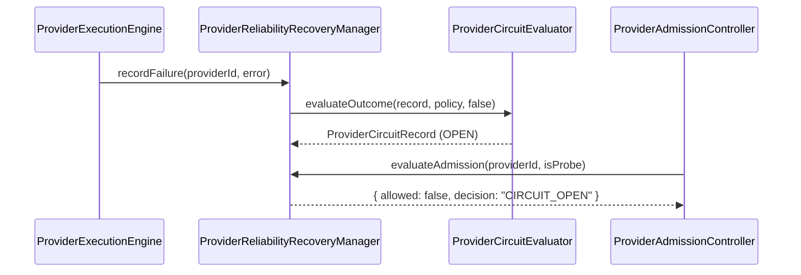

# Provider Reliability / Recovery & Circuit-Breaker Integration - Sequence Diagram

```mermaid
sequenceDiagram
  ProviderExecutionEngine->>ProviderReliabilityRecoveryManager: recordFailure(providerId, error)
  ProviderReliabilityRecoveryManager->>ProviderCircuitEvaluator: evaluateOutcome(record, policy, false)
  ProviderCircuitEvaluator-->>ProviderReliabilityRecoveryManager: ProviderCircuitRecord (OPEN)
  ProviderAdmissionController->>ProviderReliabilityRecoveryManager: evaluateAdmission(providerId, isProbe)
  ProviderReliabilityRecoveryManager-->>ProviderAdmissionController: { allowed: false, decision: "CIRCUIT_OPEN" }
```
