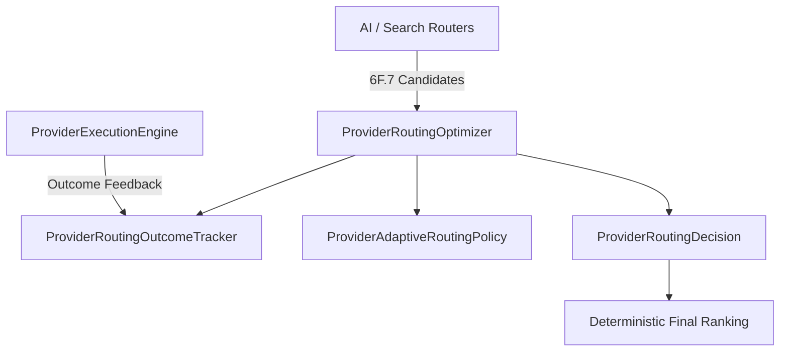

# Provider Routing Optimization & Adaptive Routing Policy - Architecture Blueprint

```mermaid
graph TD
  Engine[ProviderExecutionEngine] -- Outcome Feedback --> OutcomeTracker[ProviderRoutingOutcomeTracker]
  Router[AI / Search Routers] -- 6F.7 Candidates --> Optimizer[ProviderRoutingOptimizer]
  Optimizer --> Policy[ProviderAdaptiveRoutingPolicy]
  Optimizer --> OutcomeTracker
  Optimizer --> Decision[ProviderRoutingDecision]
  Decision --> FinalRank[Deterministic Final Ranking]
```
