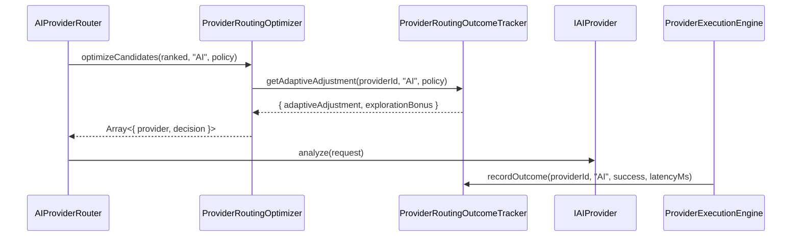

# Provider Routing Optimization & Adaptive Routing Policy - Sequence Diagram

```mermaid
sequenceDiagram
  AIProviderRouter->>ProviderRoutingOptimizer: optimizeCandidates(ranked, "AI", policy)
  ProviderRoutingOptimizer->>ProviderRoutingOutcomeTracker: getAdaptiveAdjustment(providerId, "AI", policy)
  ProviderRoutingOutcomeTracker-->>ProviderRoutingOptimizer: { adaptiveAdjustment, explorationBonus }
  ProviderRoutingOptimizer-->>AIProviderRouter: Array<{ provider, decision }>
  AIProviderRouter->>IAIProvider: analyze(request)
  ProviderExecutionEngine->>ProviderRoutingOutcomeTracker: recordOutcome(providerId, "AI", success, latencyMs)
```
