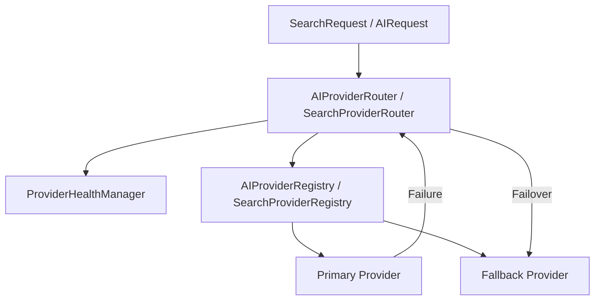

# AI & Search Provider Registries & Routing Layer - Architecture Blueprint

```mermaid
graph TD
  Request[SearchRequest / AIRequest] --> Router[AIProviderRouter / SearchProviderRouter]
  Router --> Health[ProviderHealthManager]
  Router --> Registry[AIProviderRegistry / SearchProviderRegistry]
  Registry --> Provider1[Primary Provider]
  Registry --> Provider2[Fallback Provider]
  Provider1 -- Failure --> Router
  Router -- Failover --> Provider2
```
