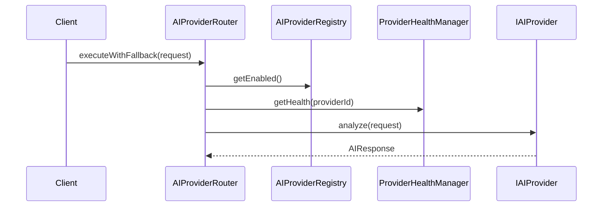

# AI & Search Provider Registries & Routing Layer - Sequence Diagram

```mermaid
sequenceDiagram
  Client->>AIProviderRouter: executeWithFallback(request)
  AIProviderRouter->>AIProviderRegistry: getEnabled()
  AIProviderRouter->>ProviderHealthManager: getHealth(providerId)
  AIProviderRouter->>IAIProvider: analyze(request)
  IAIProvider-->>AIProviderRouter: AIResponse
```
