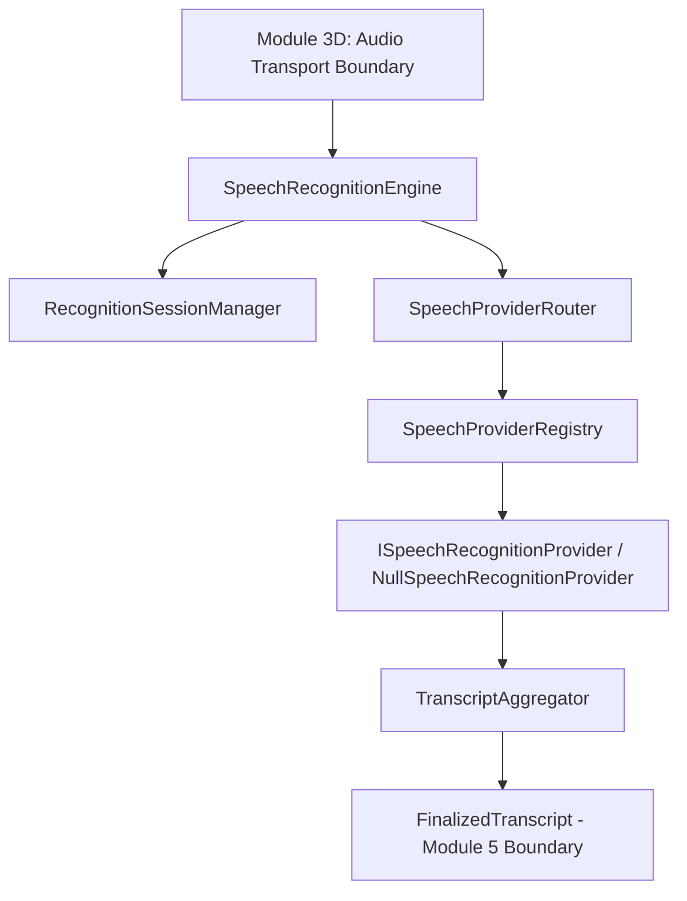

# Provider-Agnostic Speech Recognition Pipeline - Architecture Blueprint

```mermaid
graph TD
  Module3D[Module 3D: Audio Transport Boundary] --> Engine[SpeechRecognitionEngine]
  Engine --> Session[RecognitionSessionManager]
  Engine --> Router[SpeechProviderRouter]
  Router --> Registry[SpeechProviderRegistry]
  Registry --> Provider[ISpeechRecognitionProvider / NullSpeechRecognitionProvider]
  Provider --> Aggregator[TranscriptAggregator]
  Aggregator --> Output[FinalizedTranscript - Module 5 Boundary]
```
