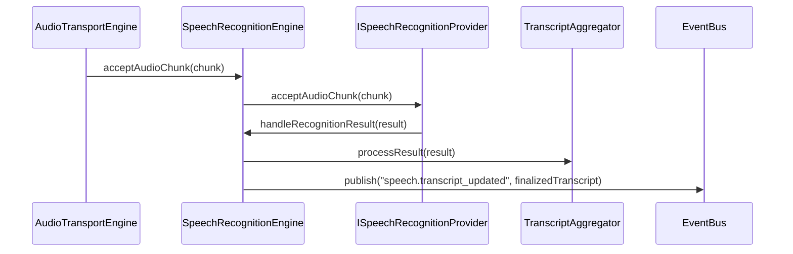

# Provider-Agnostic Speech Recognition Pipeline - Sequence Diagram

```mermaid
sequenceDiagram
  AudioTransportEngine->>SpeechRecognitionEngine: acceptAudioChunk(chunk)
  SpeechRecognitionEngine->>ISpeechRecognitionProvider: acceptAudioChunk(chunk)
  ISpeechRecognitionProvider->>SpeechRecognitionEngine: handleRecognitionResult(result)
  SpeechRecognitionEngine->>TranscriptAggregator: processResult(result)
  SpeechRecognitionEngine->>EventBus: publish("speech.transcript_updated", finalizedTranscript)
```
